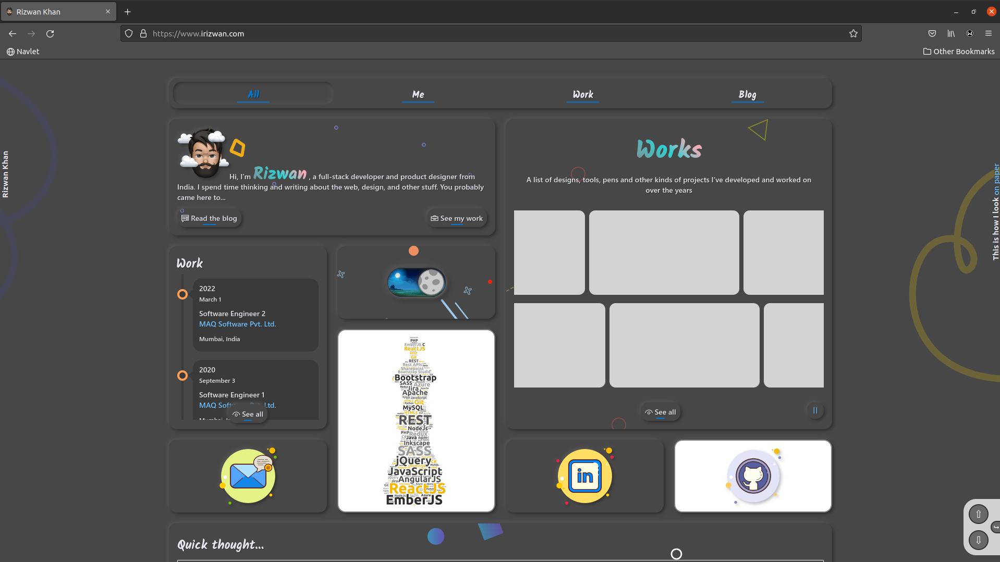
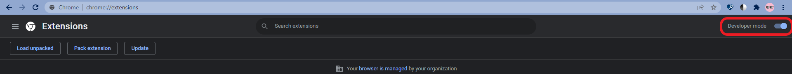

# Navlet

A chrome extension to add scroll to top button on any page

## Setup

- Clone the repo or [download](https://github.com/rizz-wan/navlet/archive/refs/heads/master.zip) the .zip and extract it.

- Navigate to `chrome://extensions` in Google Chrome.

- Turn on the `Developer mode`.

- Click on `Load unpacked` and select the extension root folder.

## Feedback & Contribution

- If you find any bugs or issues please report them on the [Issue Tracker](https://github.com/rizz-wan/navlet/issues).

> If you would like to contribute to this project please consider [forking this repo](https://github.com/rizz-wan/navlet/fork), making your changes and then creating a new [Pull Request](https://github.com/rizz-wan/navlet/pulls) back to the main code repository.

## License

MIT License

Copyright (c) 2022 Rizwan Khan

Permission is hereby granted, free of charge, to any person obtaining a copy
of this software and associated documentation files (the "Software"), to deal
in the Software without restriction, including without limitation the rights
to use, copy, modify, merge, publish, distribute, sublicense, and/or sell
copies of the Software, and to permit persons to whom the Software is
furnished to do so, subject to the following conditions:

The above copyright notice and this permission notice shall be included in all
copies or substantial portions of the Software.

THE SOFTWARE IS PROVIDED "AS IS", WITHOUT WARRANTY OF ANY KIND, EXPRESS OR
IMPLIED, INCLUDING BUT NOT LIMITED TO THE WARRANTIES OF MERCHANTABILITY,
FITNESS FOR A PARTICULAR PURPOSE AND NONINFRINGEMENT. IN NO EVENT SHALL THE
AUTHORS OR COPYRIGHT HOLDERS BE LIABLE FOR ANY CLAIM, DAMAGES OR OTHER
LIABILITY, WHETHER IN AN ACTION OF CONTRACT, TORT OR OTHERWISE, ARISING FROM,
OUT OF OR IN CONNECTION WITH THE SOFTWARE OR THE USE OR OTHER DEALINGS IN THE
SOFTWARE.
